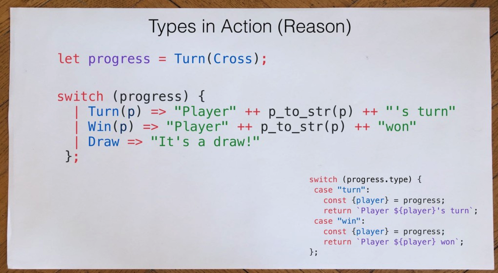

# Patrick Stapfer - Making Unreasonable States Impossible (ReasonML)
[Slides Here](https://speakerdeck.com/ryyppy/making-unreasonable-states-impossible)
## Some good references

- Effective ML REvisited - Yaron Minsky
- Types & Properties = Software: Designing with Types - Mark Seemann
- Designing with Types: Making illegal states unrepresentable - Scott Wlaschin
- Making impossible states impossible - Richard Feldman
- Back to the Basics - Using Flow - A.Sharif
- Making Impossible States Impossible in ReasonML - A. Sharif

## Issues with weak type (JavaScript)

### TicTaeToe as an example

- You don't know all possible values of a string type (endless possibilities)

```javascript
const state = {
  board: [null, ..., null],
  progress: "turn",
  player: "cross",
};
```

## Flow & TypeScript

- Thinking in types make it easier to build API, cuz you have types in mind

```typescript
type State = {
  board: Board,
  progress: Progress,
  player: Player | null,
};
```
- But....it may still result in confusing state (impossible state)

```typescript
const state: State = {
  board: [...],
  progress: "win",
  player: null,
};
```

## Possible solution

- Refactor with intersection types `&` or union type `|`

```typescript
type Progress =
  { type: "turn", player: Player }
  | { type: "win", player: Player }
  | { type: "draw" }

type State = {
  board: Board,
  progress: Progress,
  ~~ player: Player | null,~~
};
```
## Still have more issues during pattern matching (thinking about Redux reducers)

- `switch` is not an expression -> cannot assign to variable or pass to another function
- verbose syntax
- flow or typescript doesn't infer type that well
- if you put typo inside switch -> it's hard to find out
- no checks **for** exhaustiveness

```ocaml
type progress =
  | Turn(player)
  | Win(player)
  | Draw
```

## Comparison
<div style="text-align: center">
  
</div>

- Can assign to a variable or pipe to a function
- Must have return value

## Weak Type Pros & Cons
- Props
  - More Generic and flexible

- Cons
  - Cognitive Load
  - Potentially unsafe code
  - Need to write more tests

## Strong Type Pros & Cons
- Pros
  - Type safe / no surprises
  - Less tests to write

- Cons
  - More verbose code

## Conclusion
- More rigid design
- forces edge-cases to be handled